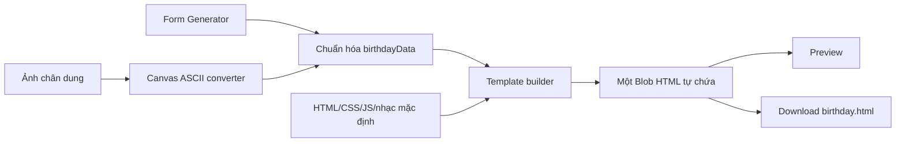

# Kế hoạch triển khai Birthday Generator — Local MVP

## 1. Mục tiêu hiện tại

Xây một ứng dụng chạy **trên máy phát triển**, cho phép người gửi nhập thông tin và tải xuống **một file HTML tự chứa** như `HappyBirthday_PhamTruongGiang.html`.

File được tạo phải:

- Mở trực tiếp bằng trình duyệt trên máy, không cần IDE và không cần cài ứng dụng cho người nhận.
- Chứa toàn bộ CSS, JavaScript, ASCII art, lời chúc, hiệu ứng và nhạc mặc định trong chính file đó.
- Có màn hình xác nhận ngày sinh và đủ 7 scene.
- Vẫn chạy trọn trải nghiệm khi không có mạng; riêng gửi điều ước Telegram được coi là tính năng tùy chọn.

Ở giai đoạn này **không deploy** Generator, Wish API, cơ sở dữ liệu hoặc file quà lên Internet.

## 2. Quyết định kỹ thuật đã chốt

| Hạng mục | Quyết định cho Local MVP |
| --- | --- |
| Generator | Vinext/Vite + React + TypeScript cho giao diện local; file quà xuất ra vẫn là HTML/CSS/JS thuần tự chứa |
| File đầu ra | Một file `.html` tự chứa, không dùng CDN hoặc tài nguyên ngoài |
| Hiệu ứng | CSS animation + một `CosmicStage` Canvas 2D dùng chung cho Scene 4–7; bánh và lọ điều ước dùng tọa độ `x/y/z`, phép xoay/chiếu phối cảnh, còn bụi sao và fireworks dùng particle system |
| Bánh sinh nhật | Cùng một bánh point-cloud 3D bằng các đốm sáng nhiều màu được giữ xuyên suốt Scene 4–6: cho xoay ở Scene 4, dịch lên ở Scene 5 và tiến gần camera ở Scene 6 |
| Lọ điều ước | Tàu vũ trụ hình lọ trong suốt, cụm động cơ gắn vào nắp; thân lọ/quỹ đạo nằm trong `CosmicStage`, còn tờ giấy và form là HTML/CSS thật để nhập liệu và truy cập bàn phím/screen reader |
| Ảnh ASCII | Xử lý ngay trong trình duyệt bằng Canvas rồi nhúng chuỗi kết quả vào HTML |
| Nhạc | Một bản mặc định được nhúng dạng data URL; chỉ phát sau thao tác mở quà để tuân thủ autoplay policy |
| Dữ liệu quà | Một khối JSON duy nhất, được tất cả scene sử dụng |
| Wish API | Node.js API chạy tại `127.0.0.1`, chỉ phục vụ kiểm thử local |
| Bí mật Telegram | Chỉ nằm trong `.env.local` của Wish API, tuyệt đối không nhúng vào HTML |
| Lưu ánh xạ quà | File local bị git-ignore, ánh xạ `giftId -> chatId` |
| Trình duyệt ưu tiên | Chrome và Edge desktop trước; Firefox/Safari và mobile kiểm tra sau khi luồng chính ổn định |

> Lưu ý: file HTML có thể được gửi và mở độc lập, nhưng tính năng Telegram chỉ hoạt động khi Wish API đang chạy và thiết bị mở file truy cập được API đó. Trong phạm vi local hiện tại, điều này có nghĩa là mở file trên cùng máy đang chạy API. Telegram vẫn cần kết nối Internet.

## 3. Phạm vi MVP

### Bắt buộc

- Form nhập tên, ngày sinh, ảnh chân dung và lời nhắn.
- Một theme hoàn chỉnh: `cosmic-blue`.
- Tự tạo initials từ từng phần của họ tên.
- Chuyển ảnh thành ASCII và xem trước theo thời gian thực.
- Điều chỉnh độ chi tiết, độ sáng, đảo màu và chế độ đơn sắc/có màu cơ bản.
- Xem trước món quà trong Generator.
- Sinh và tải xuống một file HTML tự chứa.
- Màn hình xác nhận ngày sinh, chấp nhận:
  - `15/08/2004`
  - `15-08-2004`
  - `15082004`
- Đủ 7 scene: Intro, Reveal, Wishes, Cake, Make a Wish, Blow the Candle, Finale.
- Scene 4–7 dùng liên tục một không gian vũ trụ tối; starfield, tinh vân và vị trí các lớp nền không được khởi tạo lại hoặc nháy khi chuyển scene.
- Scene 4 kết tụ bánh sinh nhật point-cloud 3D từ các đốm sáng nhiều màu; hỗ trợ kéo chuột, vuốt, bàn phím và nút đặt lại để quan sát nhiều góc.
- Scene 5 bắt buộc đưa bánh 3D lên vùng một phần ba phía trên và thu nhỏ vừa đủ, dành riêng phần giữa/phía dưới cho tàu-lọ cùng tờ giấy nhập điều ước; nút chính là `Ước` và vẫn gửi qua Wish API/Telegram.
- Scene 6 đưa camera lại gần bánh, giữ lọ trong khung; sau khi nến tắt, lọ bay đúng một vòng quanh bánh, lao lên và biến thành chùm pháo hoa mở Scene 7.
- Scene 7 bắt đầu ngay tại vụ nổ của lọ, tiếp tục cùng bầu trời và bảng màu ánh sáng rồi mới hiện lời kết và các nút xem lại.
- Bố cục ASCII bên trái và scene bên phải trên desktop; chuyển thành bố cục dọc trên màn hình nhỏ.
- Nhạc nền mặc định, bật/tắt nhạc.
- Click/tap/phím vào nến để tắt lửa, tạo khói, kích hoạt quỹ đạo của lọ và vụ nổ pháo hoa dẫn sang Finale.
- Gửi điều ước qua API local mà không lộ bot token/chat ID.
- Nếu gửi thất bại hoặc API không chạy, người nhận vẫn tiếp tục được đến scene cuối.

### Chưa làm trong MVP

- Deploy hoặc public URL.
- WebGL/Three.js, shader hoặc mô hình mesh 3D nặng; chuỗi Scene 4–7 dùng point-cloud/quỹ đạo 3D chiếu phối cảnh bằng Canvas 2D để giữ file gọn và tự chứa.
- Thổi nến bằng microphone.
- Đăng nhập, tài khoản, thư viện thiệp hoặc database production.
- Hẹn giờ mở quà.
- Nhiều template/theme hoàn chỉnh.
- Bảo mật ngày sinh như một cơ chế xác thực thật.
- Upload nhạc tùy ý nếu làm file đầu ra vượt giới hạn dung lượng; chỉ bổ sung sau khi bản nhạc mặc định ổn định.

## 4. Kiến trúc đề xuất

```text
HDPE/
├─ package.json                       # script chạy toàn bộ môi trường local
├─ app/                               # Generator UI (Vinext/Vite + React)
│  ├─ page.tsx
│  ├─ layout.tsx
│  └─ globals.css
├─ birthday-template/
│  ├─ birthday.template.html          # HTML tự chứa, có marker để nhúng dữ liệu
│  ├─ runtime.js                      # state machine của 7 scene
│  ├─ styles.css
│  ├─ effects.js                      # particles, engine trail, smoke và fireworks
│  ├─ cosmic-stage.js                  # renderer chung: starfield, camera và bánh point-cloud Scene 4–7
│  └─ wish-vessel.js                   # tàu-lọ, nắp, giấy, quỹ đạo bay và handoff sang fireworks
├─ wish-api/
│  ├─ server.mjs
│  ├─ config.mjs
│  ├─ gifts.local.json.example
│  └─ .env.local.example
├─ shared/
│  ├─ birthday-schema.js
│  └─ escape.js                       # serialize dữ liệu an toàn vào HTML
├─ scripts/
│  └─ dev.mjs                         # chạy Generator + Wish API khi phát triển
├─ tests/
│  ├─ unit/
│  └─ e2e/
├─ outputs/                           # file quà sinh ra khi test, git-ignore
└─ PLAN.md
```

Luồng dữ liệu:



## 5. Hợp đồng dữ liệu của file quà

Không tìm/thay từng dòng code. Generator chỉ dựng một object chuẩn hóa và nhúng object đó vào template:

```js
const birthdayData = {
  schemaVersion: 1,
  recipientName: "Phạm Trường Giang",
  initials: ["P", "T", "G"],
  birthday: "2004-08-15",
  message: "Chúc mày có một sinh nhật thật vui...",
  portraitAscii: {
    text: "...",
    colorRows: null,
    columns: 72,
    inverted: false
  },
  theme: "cosmic-blue",
  defaultMusicDataUrl: "data:audio/...",
  giftId: "gift_<random-id>",
  wishEndpoint: "http://127.0.0.1:8787/api/wishes"
};
```

Khi triển khai, nên nhúng dưới dạng `<script type="application/json">` và parse ở runtime thay vì nối trực tiếp chuỗi JavaScript. Mọi ký tự có thể phá vỡ HTML/script phải được escape, đặc biệt nội dung `</script>`, dấu `<`, `>` và các ký tự Unicode phân tách dòng.

Quy tắc initials:

- Trim khoảng trắng đầu/cuối và gộp nhiều khoảng trắng.
- Lấy ký tự Unicode đầu tiên của mỗi từ, giữ được tên tiếng Việt.
- Viết hoa theo locale tiếng Việt.
- Ví dụ: `Nguyễn Thị Minh Anh` → `N`, `T`, `M`, `A`.

## 6. State machine của trải nghiệm người nhận

```mermaid
stateDiagram-v2
    [*] --> Locked
    Locked --> Locked: Sai ngày sinh
    Locked --> Intro: Đúng ngày sinh
    Intro --> Reveal
    Reveal --> Wishes
    Wishes --> Cake
    Cake --> MakeAWish: Bánh dịch lên, tàu-lọ đáp xuống
    MakeAWish --> BlowCandle: Giấy vào lọ; gửi thành công/thất bại/bỏ qua
    BlowCandle --> Finale: Nến tắt, lọ bay vòng rồi nổ thành pháo hoa
    Finale --> Intro: Xem lại
    Finale --> Wishes: Mở lại lời chúc
```



Mỗi scene phải có:

- Hàm `enter()` và `exit()` rõ ràng để dọn timer, event listener và Canvas animation.
- Nút bỏ qua/tiếp tục có thể truy cập bằng bàn phím.
- Thời lượng mặc định nhưng không khóa người dùng chờ animation.
- Tôn trọng `prefers-reduced-motion` bằng cách giảm hoặc tắt chuyển động mạnh.

### 6.1. Khung trải nghiệm dùng chung

Sau khi mở khóa, giao diện dùng chung cho cả 7 scene:

```text
Desktop
┌──────────────────────────┬──────────────────────────────────────────┐
│                          │  Scene hiện tại                          │
│        ASCII ART         │                                          │
│                          │  Nội dung + hiệu ứng + tương tác         │
│  Cố định/chuyển động nhẹ │                                          │
│                          │  Điều hướng / trạng thái / nhạc          │
└──────────────────────────┴──────────────────────────────────────────┘

Mobile
┌─────────────────────────────────────────────────────────────────────┐
│ ASCII ART thu gọn                                                   │
├─────────────────────────────────────────────────────────────────────┤
│ Scene hiện tại                                                      │
└─────────────────────────────────────────────────────────────────────┘
```

- ASCII panel không bị dựng lại khi chuyển scene; chỉ đổi glow/màu nhẹ theo scene.
- Scene panel là vùng thay đổi chính, có `aria-live="polite"` cho nội dung quan trọng.
- Có chỉ báo tiến trình `1/7` đến `7/7`, nhưng không biến trải nghiệm thành form wizard khô cứng.
- “Bỏ qua” chỉ kết thúc animation hiện tại và đưa scene tới trạng thái cuối; không bỏ qua toàn bộ món quà.
- Các scene tự chuyển chỉ bắt đầu đếm sau khi asset/font/audio cần thiết đã sẵn sàng hoặc đã fallback.
- Trên mobile, ASCII chiếm tối đa khoảng 30–35% chiều cao và không đẩy nút tương tác ra ngoài viewport.
- Scene 4–7 dùng chung một `CosmicStage`: đổi scene chỉ cập nhật mode, camera và target của vật thể, không tạo lại starfield hoặc Canvas nên không có hard cut/nháy nền.
- Khi đổi scene, state machine phải hủy timer, listener và interaction riêng của scene cũ. Renderer chung chỉ bị dispose khi rời chuỗi cosmic để về Scene 1/3, khi replay hoặc khi đóng trải nghiệm.

Thời lượng dự kiến:

| Scene | Thời lượng/tương tác chính | Cách chuyển tiếp |
| --- | --- | --- |
| 1. Dramatic Intro | Khoảng 4–5 giây | Tự động hoặc “Bỏ qua” |
| 2. Big Reveal | Khoảng 5–6 giây | Tự động sau reveal hoặc “Tiếp tục” |
| 3. Heartfelt Wishes | Phụ thuộc độ dài lời nhắn | Người nhận bấm “Tiếp tục” |
| 4. Birthday Cake | Khoảng 2–3 giây kết tụ bánh, sau đó chờ người dùng khám phá | Nút “Ước một điều”; không tự chuyển khi người dùng đang xoay bánh |
| 5. Make a Wish | Khoảng 3–4 giây tàu-lọ đáp/mở giấy, sau đó không giới hạn thời gian viết | Sau khi giấy được cuộn vào lọ và request đạt trạng thái cuối, hoặc người dùng chọn không gửi |
| 6. Blow the Candle | Chờ click/tap/keyboard; khoảng 4–5 giây cho chuỗi tắt nến → orbit → bay lên | Tự chuyển tại frame lọ nổ thành pháo hoa; có thể bỏ qua phần bay sau khi nến đã tắt |
| 7. Cosmic Grand Finale | Bắt đầu tại vụ nổ của lọ và giữ đến khi đóng file | Xem lại hoặc mở lại lời chúc |

### 6.2. Màn hình xác nhận trước Scene 1

Đây là màn hình khóa vui, không được tính là một trong 7 scene.

Giao diện:

- Mascot hoặc ảnh đại diện nhỏ, tiêu đề kiểu “Có một món quà đang chờ...”.
- Một ô nhập ngày sinh và nút `Mở món quà`.
- Gợi ý định dạng nhưng không hiển thị ngày sinh thật.
- Chú thích ngắn rằng đây không phải cơ chế bảo mật.

Hành vi:

- Chuẩn hóa input bằng cách bỏ `/`, `-` và khoảng trắng rồi so sánh dạng `DDMMYYYY`.
- Chấp nhận `DD/MM/YYYY`, `DD-MM-YYYY` và `DDMMYYYY`.
- Kiểm tra đây là ngày lịch hợp lệ trước khi so sánh.
- Nhập sai: input rung nhẹ, viền đổi màu và mascot/heart phản hồi; không xóa input ngay.
- Nhập đúng: khóa form để tránh double-submit, phát hạt sáng mở khóa rồi vào Scene 1.
- Click mở quà cũng là user gesture để bắt đầu nhạc; nếu audio lỗi thì trải nghiệm vẫn tiếp tục.

Tiêu chí nghiệm thu:

- Không thể mở khóa bằng ngày không hợp lệ như `31/02/2004`.
- Cả ba định dạng yêu cầu cho cùng một kết quả.
- Nhấn `Enter` hoạt động; focus và thông báo lỗi đọc được bằng screen reader.

### 6.3. Scene 1 — Dramatic Intro

Mục tiêu: tạo nhịp mở đầu bí ẩn và giới thiệu từng chữ viết tắt của người nhận.

Giao diện và hiệu ứng:

- Nền không gian xanh đêm/tím rất tối với sao và bụi sáng chuyển động chậm.
- Mỗi phần tử trong `birthdayData.initials` bay lần lượt từ xa vào trung tâm.
- Chữ có scale từ nhỏ tới lớn, glow, motion blur ngắn và rung nhẹ theo nhịp tim.
- Sau khi chữ cuối xuất hiện, các chữ xếp thành một hàng hoặc cụm cân bằng rồi cùng phát sáng.
- Không hard-code đúng ba chữ; tên có hai, bốn hoặc nhiều initials vẫn phải bố trí được.

Tương tác và chuyển scene:

- Tự chuyển sang Scene 2 sau khi chuỗi animation kết thúc.
- Nút `Bỏ qua` nhỏ đưa tất cả initials về trạng thái cuối rồi chuyển tiếp nhanh.
- Với `prefers-reduced-motion`, dùng fade + scale nhẹ, không rung hoặc lao từ xa.

Tiêu chí nghiệm thu:

- Các initials xuất hiện đúng thứ tự tên.
- Không có chữ nào tràn khung ở tên dài hoặc màn hình 360 px.
- Bỏ qua không để animation/timer Scene 1 chạy chồng lên Scene 2.

### 6.4. Scene 2 — Big Reveal

Mục tiêu: reveal lời chúc sinh nhật và tên đầy đủ như khoảnh khắc chính đầu tiên.

Giao diện và hiệu ứng:

- Hạt bụi vàng từ các cạnh hội tụ về tâm Canvas.
- Khi hội tụ xong, dòng `HAPPY BIRTHDAY` hiện bằng glow/fade mạnh.
- `recipientName` xuất hiện bên dưới bằng typewriter; ký tự Unicode tiếng Việt không bị tách lỗi.
- Bóng bay, mũ sinh nhật hoặc ngôi sao trang trí bay nhẹ quanh tên, không che nội dung.
- ASCII panel tăng glow đồng bộ với khoảnh khắc reveal.

Tương tác và chuyển scene:

- Có thể tự chuyển sau một khoảng nghỉ ngắn khi typewriter hoàn tất.
- Nút `Tiếp tục` xuất hiện ngay khi reveal xong; `Bỏ qua` hoàn tất text tức thì.
- Nếu Canvas không hoạt động, tiêu đề và tên vẫn hiện bằng CSS fallback.

Tiêu chí nghiệm thu:

- Tên rất dài tự co/wrap hợp lý và không làm lệch bố cục.
- Tên được render như text, không dùng `innerHTML` từ dữ liệu người gửi.
- Người dùng reduced-motion thấy đầy đủ nội dung mà không phải chờ hiệu ứng.

### 6.5. Scene 3 — Heartfelt Wishes

Mục tiêu: dành đủ không gian để người nhận đọc trọn lời nhắn.

Giao diện và hiệu ứng:

- Một tấm thiệp kính mờ xuất hiện ở trung tâm với border glow nhẹ.
- Lời nhắn giữ nguyên xuống dòng bằng `white-space: pre-wrap`.
- Các dòng hiện lần lượt bằng fade/typewriter; tốc độ có giới hạn để lời nhắn dài không kéo quá lâu.
- Thiệp có chiều cao tối đa và vùng scroll riêng nếu nội dung dài.
- Có thể thêm chữ ký/tên người gửi sau này; MVP không bắt buộc nếu chưa có field tương ứng.

Tương tác và chuyển scene:

- Click vào nội dung hoặc nút `Hiện toàn bộ` hoàn tất animation chữ ngay.
- Nút `Tiếp tục` luôn truy cập được, không nằm cuối vùng scroll.
- Khi quay lại từ Finale, mở Scene 3 ở trạng thái đã hiện toàn bộ lời nhắn.

Tiêu chí nghiệm thu:

- Lời nhắn ngắn không tạo khoảng trống quá lớn; lời nhắn dài không làm vỡ viewport.
- Các ký tự HTML trong message hiển thị như văn bản, không được thực thi.
- Người nhận có thể đọc và scroll bằng chuột, touch và bàn phím.

### 6.6. Scene 4 — Birthday Cake

Mục tiêu: biến màn giới thiệu bánh thành điểm nhấn tương tác 3D — một chiếc bánh bằng ánh sáng đang trôi trong vũ trụ — rồi dẫn tự nhiên sang phần viết điều ước.

Định hướng hình ảnh:

- Vùng scene trở thành một cửa sổ vũ trụ tối màu xanh đêm/tím, có nhiều lớp sao, bụi tinh vân và parallax rất nhẹ; các decoration pastel của layout chung phải được ẩn hoặc giảm trong toàn bộ Scene 4–7 để không phá không khí.
- Bánh không còn là khối HTML/CSS phẳng. Hình bánh được tạo từ hàng nghìn đốm sáng nhiều màu trên một mô hình có tọa độ `x/y/z`: ba tầng bánh, viền kem, sprinkles, đĩa bánh, nến và cụm lửa.
- Bảng màu hạt ưu tiên cyan, tím, hồng và vàng ấm. Mỗi hạt có kích thước/độ sáng thay đổi theo chiều sâu; dùng glow và chế độ hòa trộn sáng để tạo cảm giác các hạt đang phát quang.
- Khi vào scene, các hạt từ starfield hội tụ trong khoảng 2–3 giây để lắp thành chiếc bánh. Sau khi hoàn chỉnh, bánh tự xoay rất chậm và các hạt chỉ twinkle nhẹ, không rung hoặc biến dạng silhouette.

Mô hình 3D và cách render:

- Dữ liệu bánh là một tập điểm 3D thật theo trục `x/y/z`. Mỗi frame áp dụng yaw/pitch, sắp xếp theo độ sâu và chiếu phối cảnh lên một Canvas 2D riêng của Scene 4.
- Không thêm Three.js, CDN, texture hoặc asset ngoài. Glow/sprite hạt được tạo ngay trong runtime để file HTML xuất ra vẫn tự chứa và chạy offline.
- Bánh nằm trong `CosmicStage` dùng chung cho Scene 4–7. Chỉ vùng điều khiển của Scene 4 nhận pointer để xoay; CTA và nội dung hướng dẫn nằm ngoài hit-area của Canvas.

Tương tác góc nhìn:

- Kéo chuột sang trái/phải để xoay quanh trục dọc; kéo lên/xuống để đổi góc nhìn từ trên hoặc thấp hơn. Pitch được giới hạn để bánh không bị lật úp hoặc biến mất khỏi camera.
- Trên touch, vuốt một ngón trực tiếp trên vùng bánh để xoay; pinch hoặc wheel chỉ zoom trong một khoảng an toàn, không cho camera xuyên qua hay làm crop bánh.
- Khi thả tay, bánh có quán tính giảm dần rồi trở lại nhịp tự xoay chậm. Bất kỳ thao tác chủ động nào cũng tạm dừng auto-rotate để góc nhìn không chống lại người dùng.
- Canvas có thể nhận focus: phím mũi tên xoay bánh, `+`/`-` zoom và `R` đặt lại góc nhìn. Đồng thời có nút `Đặt lại góc nhìn` hiển thị rõ cho cả chuột và touch.
- Dòng hướng dẫn ngắn: `Kéo để xoay • Cuộn để phóng to/thu nhỏ`; screen reader nhận được mô tả tương đương nhưng không phải đọc từng hạt.

Tương tác và chuyển scene:

- Scene này dùng drag để khám phá bánh; click vào nến chưa tắt lửa và không được vô tình chuyển scene.
- Sau khi bánh kết tụ xong, hiện thông điệp ngắn và nút `Ước một điều`. Không auto-advance để người dùng có thời gian xoay và quan sát.
- Khi bấm CTA, khóa drag/zoom, đưa camera về góc ba phần tư và dịch chính chiếc bánh point-cloud lên trên một chút để nhường chỗ cho tàu-lọ ở Scene 5; starfield và vị trí sao không được reset.
- Khi rời Scene 4, phải nhả pointer capture, tắt interaction/quán tính riêng của Scene 4 và bàn giao renderer cho Scene 5. Chỉ hủy RAF/resize/visibility listener chung khi rời toàn bộ chuỗi Scene 4–7 hoặc replay.

Hiệu năng, reduced motion và fallback:

- Giới hạn `devicePixelRatio` tối đa 2 và giảm số hạt theo kích thước viewport/hiệu năng thiết bị; mục tiêu 30–60 FPS, ưu tiên phản hồi kéo mượt hơn mật độ hạt.
- Khi tab bị ẩn, tạm dừng render. Resize/orientation change phải giữ bánh ở giữa và không làm mất góc nhìn đang dùng.
- Với `prefers-reduced-motion`, bỏ animation hội tụ, auto-rotate, quán tính và twinkle; hiển thị bánh đã hoàn chỉnh nhưng vẫn cho xoay thủ công.
- Nếu Canvas hoặc runtime 3D lỗi, hiển thị silhouette bánh bằng các đốm sáng 2D/CSS tĩnh cùng thông điệp và CTA; fallback này phải tiếp tục dùng được trong Scene 5–7.

Tiêu chí nghiệm thu:

- Nhìn chính diện, góc nghiêng và từ trên xuống đều nhận ra rõ ba tầng bánh, nến và chiều sâu; xoay trái/phải/lên/xuống tạo thay đổi góc nhìn đúng hướng.
- Drag chuột, touch và bàn phím đều hoạt động; nhả chuột ngoài Canvas không làm kẹt trạng thái kéo; CTA không bị Canvas chặn.
- Bánh luôn nằm trọn trong vùng scene ở viewport 360 px, desktop phổ biến và sau khi đổi orientation; zoom bị chặn trong khoảng an toàn.
- Đi qua chuỗi Scene 4–7 rồi replay ít nhất ba lần không nhân đôi renderer, RAF/listener hoặc làm giảm hiệu năng rõ rệt.
- Transition Scene 4 → 5 không có hard cut, không đổi starfield và không thay bánh point-cloud bằng bánh 2D.
- Reduced-motion và fallback vẫn hiển thị một chiếc bánh dễ nhận biết, có glow, nút đặt lại/tiếp tục dùng được.
- File prototype và HTML xuất ra vẫn là một file tự chứa, chạy offline và không có CDN hoặc asset 3D bên ngoài.

### 6.7. Scene 5 — Make a Wish: Wish Jar Landing

Mục tiêu: tiếp nối trực tiếp chiếc bánh 3D và không gian của Scene 4, biến việc viết điều ước thành một nghi thức với tàu-lọ điều ước, đồng thời vẫn gửi nội dung qua Wish API/Telegram mà không chặn trải nghiệm khi lỗi mạng.

Bối cảnh và bố cục:

- Giữ nguyên `CosmicStage`, starfield và tinh vân của Scene 4; tuyệt đối không đổi về nền pastel, không random lại vị trí sao và không tạo Canvas mới.
- Cùng chiếc bánh point-cloud phải di chuyển rõ ràng lên một phần ba phía trên: tâm bánh nằm khoảng 20–25% chiều cao vùng scene, scale còn khoảng 65–75% so với Scene 4 và toàn bộ bounding box của bánh không vượt xuống dưới khoảng 42% chiều cao. Phần giữa/phía dưới được coi là vùng dành riêng cho tàu-lọ và tờ giấy; ngọn nến vẫn cháy. Camera dùng preset cố định và tạm khóa thao tác xoay để không xung đột với form.
- Trên mobile, ưu tiên chỗ viết: bánh tiếp tục neo ở phía trên và có thể giảm còn khoảng 55–65% scale, trong khi lọ/giấy chiếm phần không gian còn lại. Không được giữ bánh ở giữa rồi đặt form đè lên bánh; nếu chiều cao quá thấp, vùng giấy được cuộn nội bộ nhưng CTA vẫn phải nằm trong viewport.
- Tàu vũ trụ có hình một chiếc lọ trong suốt với viền glow. Nắp lọ đồng thời là cụm động cơ, có hai luồng đẩy nhỏ, đèn định vị và vệt hạt cùng bảng màu cyan–tím–hồng–vàng của bánh.
- Lọ và đường bay nằm trong cùng hệ tọa độ/chiếu phối cảnh với bánh. Tờ giấy sau khi mở là một lớp HTML/CSS đặt đúng vị trí miệng lọ để textarea vẫn là control thật, không phải chữ vẽ lên Canvas.

Choreography khi vào scene:

1. Bánh hoàn tất chuyển động lên vùng một phần ba phía trên, giảm scale theo breakpoint và giữ góc ba phần tư từ cuối Scene 4; chỉ sau khi vùng giữa/phía dưới đã trống thì tàu-lọ mới bắt đầu bay vào.
2. Tàu-lọ xuất hiện từ xa, lượn theo một đường cong đi ngang qua bánh; scale, glow và thứ tự trước/sau thay đổi để tạo cảm giác chiều sâu.
3. Lọ đáp xuống tiền cảnh ở nửa dưới scene, động cơ giảm sáng rồi tắt.
4. Cụm nắp–động cơ mở lên, tờ giấy bay ra khỏi miệng lọ và tự mở thành bề mặt viết điều ước.
5. Sau khi giấy mở xong, form mới nhận tương tác. Quỹ đạo dùng tọa độ tương đối theo viewport; trên mobile đường bay ngắn hơn và không che bánh, giấy hoặc CTA.

Giao diện nhập điều ước:

- Tờ giấy chứa một `<form>` thật với label, textarea tối đa 500 ký tự, bộ đếm `0/500`, nút chính `Ước` và nút phụ `Tiếp tục không gửi`.
- Hiển thị rõ: `Điều ước này sẽ được gửi đến người tạo món quà qua Telegram nếu dịch vụ đang hoạt động.`
- Không tự focus textarea giữa hoạt cảnh để tránh bật bàn phím ảo ngoài ý muốn; khi giấy sẵn sàng, `aria-live="polite"` thông báo người dùng có thể bắt đầu viết.
- Tàu-lọ, động cơ, trail và các hạt trang trí dùng `aria-hidden="true"`; trạng thái form/API phải được thông báo riêng bằng vùng status.

Choreography khi bấm `Ước`:

1. Trim và kiểm tra nội dung; không cho gửi chuỗi rỗng hoặc chỉ có khoảng trắng.
2. Chụp một snapshot nội dung trong memory, khóa textarea/nút để chống gửi lặp và bắt đầu request `giftId + wish` cùng lúc với animation.
3. Tờ giấy tự cuộn lại, thu nhỏ, chui vào lọ; cụm nắp–động cơ đóng lại và phát sáng nhẹ trong lúc chờ phản hồi.
4. Chỉ công bố thành công sau khi cả animation đóng lọ và response API hoàn tất. Khi thành công, lọ phát một nhịp glow, hiện `Điều ước đã được gửi vào vũ trụ ✨` và nút `Đến lúc thổi nến`.
5. Nếu lỗi, timeout hoặc API không chạy, nắp mở lại và giấy bung ra với nguyên nội dung đã nhập; hiện `Thử lại` và `Tiếp tục không gửi`, không tự retry.
6. Nếu người dùng chọn tiếp tục không gửi, giấy vẫn cuộn vào lọ và nắp đóng để giữ continuity, nhưng không tạo request Telegram.

Các trạng thái bắt buộc:

| Trạng thái | Hiển thị/hành vi |
| --- | --- |
| `arriving` | Bánh dịch lên, tàu-lọ bay vào và đáp; form chưa nhận tương tác |
| `editing` | Nắp mở, giấy đã bung; cho nhập và nút `Ước` chỉ bật khi nội dung hợp lệ |
| `packing` | Giấy đang cuộn/chui vào lọ; khóa textarea và submit lặp |
| `submitting` | Lọ đã đóng, engine pulse nhẹ, form có `aria-busy="true"` và chờ API |
| `success` | Xác nhận đã gửi, lọ được niêm phong và chỉ cho đi tiếp |
| `error` | Nắp/giấy mở lại, giữ nguyên draft; cho thử lại hoặc tiếp tục không gửi |
| `offline/timeout` | Nêu rõ chưa gửi được, không che nút tiếp tục và không tự retry |
| `skipped` | Không gọi API; giấy/lọ đóng ở trạng thái trung tính để sang Scene 6 |

Hành vi kỹ thuật và fallback:

- Gửi `giftId` + `wish`; không gửi ngày sinh, ảnh, tên người nhận hoặc Telegram metadata. Token bot và `chatId` không xuất hiện trong HTML/request.
- Double-click, nhấn phím lặp hoặc callback muộn chỉ tạo tối đa một request đang chạy và một chuỗi đóng giấy. Khi rời scene, bỏ qua callback không còn thuộc state hiện tại.
- Không lưu điều ước vào `localStorage`; chỉ giữ draft/snapshot trong memory của lần mở file.
- Với `prefers-reduced-motion`, bỏ flyby, landing rung, giấy cuộn và engine pulse: bánh đổi vị trí bằng fade ngắn, lọ xuất hiện tại điểm đáp và giấy mở/đóng gần như tức thì.
- Nếu Canvas lỗi, dùng bánh ánh sáng 2D tĩnh và lọ HTML/CSS đơn giản; form giấy vẫn phải nhập, gửi, thử lại hoặc bỏ qua đầy đủ. Timeout bảo vệ phải hoàn tất trạng thái nếu `animationend` không chạy.

Tiêu chí nghiệm thu:

- Scene 4 → 5 không nháy nền, không đổi vị trí sao và không biến bánh point-cloud thành bánh CSS.
- Tàu-lọ lượn qua bánh, đáp xuống, mở đúng nắp có gắn động cơ và đưa giấy ra rõ ràng trên desktop/mobile.
- Nút `Ước` với whitespace bị chặn; double-click chỉ tạo một request; draft không mất khi request thất bại.
- Success, error, offline, timeout và skip đều có đường đi rõ ràng tới Scene 6.
- Bánh nằm trọn trong vùng trên và không chạm/che thân lọ, tờ giấy, textarea hoặc CTA; ràng buộc này phải đúng ở viewport 360 px, desktop phổ biến và sau orientation change.
- Tờ giấy có đủ diện tích nhập liệu ở phần giữa/phía dưới; reduced-motion/Canvas fallback vẫn giữ đúng phân vùng bố cục và dùng được toàn bộ form.

### 6.8. Scene 6 — Blow the Candle: Wish Jar Launch

Mục tiêu: giữ nguyên sân khấu vũ trụ và lọ điều ước của Scene 5, đưa người xem lại gần bánh để thổi nến, sau đó dùng chuyến bay của lọ làm cầu nối trực tiếp sang pháo hoa Finale.

Bối cảnh và bố cục khi vào scene:

- Giữ nguyên starfield, tinh vân, bánh point-cloud và lọ đã đóng từ Scene 5; không remount renderer hoặc tạo lại các vật thể.
- Tờ giấy/form biến mất. Camera dolly gần bánh, đưa bánh lớn trở lại trung tâm nhưng vẫn nằm trọn viewport; góc nhìn được khóa ở preset chính diện hơi chếch để vị trí ngọn nến ổn định.
- Lọ điều ước đỗ lệch sang một bên trong tiền cảnh, thu nhỏ vừa đủ nhưng luôn nhìn thấy và không che bánh/ngọn nến. Nếu wish gửi thành công, bên trong lọ có glow nhẹ; nếu bỏ qua hoặc lỗi, lọ dùng trạng thái sáng trung tính.
- Hiện chỉ dẫn `Chạm vào ngọn nến để thổi`.

Tương tác thổi nến:

- Ngọn lửa có một button DOM trong suốt được neo theo tọa độ chiếu của đầu nến, hit-area tối thiểu 44×44 CSS pixels và accessible name `Thổi tắt nến sinh nhật`.
- Hỗ trợ click, tap, `Enter` và `Space`; không dùng microphone trong MVP và chỉ lần kích hoạt đầu tiên có hiệu lực.
- Khi kích hoạt, luồng gió chạy ngang, cụm lửa co lại rồi tắt hoàn toàn, sau đó dải khói hạt bay lên. `aria-live="polite"` thông báo: `Nến đã tắt. Lọ điều ước đang bay lên.`

Choreography sau khi nến tắt:

1. Cụm động cơ trên nắp lọ khởi động và lọ nhấc khỏi vị trí đỗ.
2. Lọ bay đúng một vòng quanh bánh theo quỹ đạo ellipse 3D; nửa quỹ đạo đi sau bánh và nửa còn lại đi trước bánh, với scale/độ sáng/z-order thể hiện rõ chiều sâu.
3. Hoàn tất một vòng, lọ đổi hướng, tăng tốc bay lên phía trên và để lại một vệt bụi sao ngắn.
4. Tại đỉnh quỹ đạo, lọ thu nhỏ thành một điểm sáng rồi bung thành chùm pháo hoa đầu tiên.
5. Sự kiện hoàn tất burst chuyển state machine sang Scene 7 và truyền tọa độ vụ nổ; không fade nền, không tạo lại starfield và không phát fireworks chung trước thời điểm này.
6. Sau khi nến đã tắt, nút `Bỏ qua hiệu ứng` có thể đưa lọ thẳng tới điểm sáng cuối rồi kích hoạt burst, nhưng không được bỏ qua trạng thái flame-out.

Reduced motion, lỗi và lifecycle:

- Với `prefers-reduced-motion`, bỏ camera dolly mạnh, quỹ đạo vòng và tăng tốc: lửa tắt, lọ crossfade thành một điểm sáng phía trên rồi chuyển sang starburst tĩnh của Scene 7.
- Nếu Canvas/quỹ đạo lỗi, flame DOM vẫn tắt; lọ fallback translate/fade lên trên rồi tạo CSS starburst. Một finalizer/timeout bảo vệ luôn đưa trải nghiệm tới Scene 7.
- Khi tab bị ẩn, tạm dừng choreography; khi quay lại tiếp tục từ state hiện tại, không chạy bù nhiều frame.
- Khi rời Scene 6, dọn smoke, candle hit-area và listener riêng nhưng bàn giao `CosmicStage` cùng tọa độ burst cho Scene 7.

Tiêu chí nghiệm thu:

- Bánh được phóng gần nhưng không crop và lọ vẫn nhìn thấy ở desktop, mobile và sau orientation change.
- Flame hit-area bám đúng đầu nến, dùng được bằng touch/bàn phím và không trôi khi resize.
- Một lần kích hoạt chỉ tạo đúng một chuỗi: flame-out → smoke → một vòng quanh bánh → bay lên → một burst.
- Lọ thể hiện rõ nửa vòng đi sau/nửa vòng đi trước bánh; tâm burst đầu Scene 7 khớp vị trí cuối của lọ.
- Replay ba lần không nhân timer, RAF, smoke, orbit, burst hoặc listener.

### 6.9. Scene 7 — Cosmic Grand Finale

Mục tiêu: biến trực tiếp vụ nổ của lọ điều ước thành màn kết trong cùng vũ trụ, không tạo cảm giác chuyển sang một scene rời rạc.

Chuyển tiếp và hình ảnh:

- Scene 7 bắt đầu ngay tại frame lọ hóa thành pháo hoa. Chùm đầu tiên sinh đúng tại tọa độ cuối của lọ và giữ bảng màu cyan, tím, hồng, vàng của bánh.
- Starfield/tinh vân tiếp tục từ Scene 6. Không tạo Canvas hoặc nền mới; các đợt pháo hoa phụ lan ra sau burst đầu rồi giảm về tần suất thấp để tiết kiệm CPU.
- Lọ không còn xuất hiện sau khi đã hóa thành pháo hoa. Bánh vẫn sáng trong vài nhịp đầu, sau đó lùi xa và tản nhẹ thành một quầng sao bao quanh lời kết thay vì biến mất đột ngột.
- Thay confetti dày bằng bụi sao, sparkle và vài vệt sao băng để giữ đúng ngôn ngữ hình ảnh vũ trụ.
- Hiện lời kết: `Chúc [recipientName], mọi điều ước đều tìm được đường tới những vì sao ✨`. Chỉ khi API thực sự thành công mới hiện thêm xác nhận nhỏ rằng điều ước đã được gửi; trạng thái lỗi/bỏ qua không được tạo thông báo gây hiểu nhầm.
- ASCII panel nhận glow cuối cùng đồng bộ với màu của burst đầu.

Các nút bắt buộc:

- `Xem lại`: quay về Scene 1, không yêu cầu nhập lại ngày sinh.
- `Mở lại lời chúc`: chuyển tới Scene 3 ở trạng thái text đã hiển thị đầy đủ.
- `Tắt/bật nhạc`: giữ trạng thái nhất quán trong toàn bộ lần mở file.
- `Bỏ qua hiệu ứng`: đưa fireworks về mật độ nền thấp và hiện ngay toàn bộ lời kết/nút.

Lifecycle, replay và fallback:

- Scene 7 chỉ đổi mode của `CosmicStage`, không tạo thêm starfield/Canvas. Khi tab bị ẩn, dừng hoặc giảm RAF; khi active chỉ tiếp tục một renderer.
- Replay reset camera, bánh, flame, lọ, nắp, giấy, form, smoke, orbit và fireworks. Nếu wish đã gửi thành công trong phiên, Scene 5 replay hiển thị trạng thái đã gửi và không tự POST Telegram lần hai.
- Khi rời Scene 7 về Scene 1/3, dispose renderer và hủy toàn bộ timer/listener cosmic trước khi dựng scene đích.
- Với reduced-motion, hiển thị starburst/constellation tĩnh, lời kết và controls ngay; không chạy fireworks liên tục hoặc flash mạnh.
- Nếu Canvas lỗi, vẫn hiển thị gradient vũ trụ, CSS starburst, tên người nhận và đầy đủ controls.

Tiêu chí nghiệm thu:

- Không có hard cut, frame trắng/pastel hoặc khoảng trống giữa Scene 6 và 7.
- Vụ pháo hoa đầu tiên bắt nguồn chính xác từ vị trí lọ biến mất; Finale không tuyên bố đã gửi wish nếu API thất bại hoặc bị bỏ qua.
- Sau ít nhất ba lần replay không có Canvas, audio, timer, listener, lọ hoặc fireworks instance bị nhân bản và không gửi Telegram lặp ngoài ý muốn.
- Tất cả controls dùng được bằng chuột, touch và bàn phím trong chế độ thường, reduced-motion và fallback.

## 7. Ma trận skill cần dùng

Trong tài liệu này:

- **Skill kỹ thuật** là năng lực cần để thiết kế, code và kiểm thử sản phẩm.
- **Codex skill** là gói hướng dẫn/công cụ chuyên biệt sẽ được gọi khi nó thực sự giúp triển khai hoặc QA.
- Một skill được ghi là “tùy chọn” không được phép tự làm tăng phạm vi MVP.

### 7.1. Skill theo từng phần của hệ thống

| Phần | Skill kỹ thuật cần có | Áp dụng cụ thể | Mức độ |
| --- | --- | --- | --- |
| Kiến trúc frontend | JavaScript ES modules, DOM, event lifecycle, finite-state machine | Chia module, điều phối 7 scene, cleanup timer/listener và replay | Bắt buộc |
| UI nền tảng | Semantic HTML, responsive CSS, CSS variables, layout Grid/Flexbox | Màn hình khóa, khung ASCII/scene, desktop/mobile và theme | Bắt buộc |
| Motion design | CSS keyframes/transitions, easing, choreography và reduced motion | Kết tụ bánh, flyby/landing của lọ, mở–cuộn giấy, flame/smoke, orbit, ascent và burst | Bắt buộc |
| Canvas effects | Canvas 2D, `requestAnimationFrame`, particle system, shared renderer và performance budget | Starfield liên tục, engine trail, smoke, lọ bay quanh bánh và bottle-origin fireworks | Bắt buộc |
| 3D point-cloud | Vector 3D, yaw/pitch, camera preset, perspective projection, depth sorting, Canvas blending và Pointer Events | Bánh Scene 4–6, lọ/quỹ đạo Scene 5–6 và handoff tọa độ burst sang Scene 7 | Bắt buộc |
| Accessibility | Keyboard navigation, focus management, ARIA, semantic form, contrast, `prefers-reduced-motion` | Mở khóa, giấy/textarea/nút `Ước`, API status, candle button và finale controls | Bắt buộc |
| Unicode/i18n | Unicode-safe string handling, Vietnamese locale, grapheme segmentation | Initials, typewriter tên tiếng Việt, filename và lời nhắn | Bắt buộc |
| Template/export | JSON schema, safe serialization, escaping, Blob, data URL, download API | Nhúng `birthdayData`, CSS/JS/audio và xuất một HTML tự chứa | Bắt buộc |
| Image/ASCII | File API, Canvas pixel access, crop/resize, grayscale, contrast, character mapping | Chuyển chân dung thành ASCII và preview realtime | Bắt buộc |
| Browser media | Web Audio/HTMLAudio, autoplay policy, page visibility | Nhạc nền, mute/unmute và pause khi tab ẩn | Bắt buộc |
| Preview sandbox | `iframe.srcdoc`, sandbox policy, postMessage nếu cần | Xem trước file quà mà không làm ảnh hưởng Generator | Bắt buộc |
| API local | Node.js HTTP/Express hoặc tương đương, validation, timeout, error handling | `POST /api/gifts`, `POST /api/wishes` | Bắt buộc cho Telegram local |
| Telegram integration | Telegram Bot API, plain-text message formatting, secrets management | Gửi wish mà không để lộ token/chat ID | Bắt buộc cho Telegram local |
| Web security | XSS-safe rendering, CORS `Origin: null`, input limits, rate-limit, secret hygiene | Bảo vệ template và API local | Bắt buộc |
| Automated testing | Unit test, browser E2E, fixtures, regression testing | Date parser, initials, serializer, generate/download và 7-scene flow | Bắt buộc |
| Performance/debug | DevTools profiling, shared RAF/layer inspection, memory/timer inspection, adaptive particle count | Giữ một `CosmicStage` Scene 4–7, đúng z-order và không nhân renderer khi replay | Bắt buộc |
| Raster art direction | Asset prompting/editing, compression, transparent background | Mascot hoặc texture riêng nếu CSS/ảnh người gửi chưa đủ | Tùy chọn |

### 7.2. Skill theo màn hình và từng scene

| Màn hình/scene | Skill trọng tâm | Điểm phải chứng minh khi review |
| --- | --- | --- |
| Màn hình xác nhận | Form validation, date parsing, focus/ARIA, audio autoplay policy | Ba định dạng ngày đúng; ngày lịch sai bị chặn; Enter và screen reader dùng được |
| Scene 1 — Dramatic Intro | CSS transforms, staggered animation, dynamic layout, timer cleanup | Số initials bất kỳ vẫn cân; skip không để timer rò sang Scene 2 |
| Scene 2 — Big Reveal | Canvas particles, Unicode-safe typewriter, responsive typography | Tên tiếng Việt/tên dài không lỗi; Canvas lỗi vẫn có CSS fallback |
| Scene 3 — Heartfelt Wishes | Safe text rendering, overflow/scroll UX, typography, keyboard access | Message dài/HTML-like hiển thị an toàn và đọc được trên mobile |
| Scene 4 — Birthday Cake | Point-cloud 3D, phép chiếu phối cảnh Canvas 2D, Pointer Events, keyboard control và shared-stage handoff | Bánh có chiều sâu rõ; drag/touch/phím xoay đúng; chuyển Scene 5 không reset nền/bánh |
| Scene 5 — Wish Jar Landing | Choreography 2.5D, semantic form, async state machine, Fetch API, validation và privacy/error UX | Lọ flyby/đáp/mở giấy rõ; `Ước` cuộn giấy và chỉ gửi một request; mọi trạng thái đều đi tiếp được |
| Scene 6 — Wish Jar Launch | Projected hit-area, idempotent input, orbit/depth choreography và event handoff | Nến tắt một lần; lọ bay đúng một vòng, bay lên và tạo đúng một bottle-origin burst |
| Scene 7 — Cosmic Grand Finale | Shared Canvas lifecycle, burst continuation, Page Visibility API, audio state và replay reset | Bắt đầu liền frame từ vị trí lọ; không báo gửi sai trạng thái; replay không nhân instance/request |

### 7.3. Codex skill sẽ dùng khi triển khai

| Codex skill | Khi nào dùng | Phạm vi cụ thể | Trạng thái trong MVP |
| --- | --- | --- | --- |
| `browser:control-in-app-browser` | Sau mỗi mốc UI có thể chạy | Mở app local, thao tác form/scene, test responsive, xem console và chụp ảnh kiểm chứng | Cần dùng ở Giai đoạn 1, 3 và 5 |
| `imagegen` | Chỉ khi quyết định cần mascot, background hoặc texture raster riêng | Sinh/chỉnh asset, sau đó nén và nhúng local vào file HTML | Tùy chọn; không chặn MVP |
| `visualize:visualize` | Khi cần thử nhanh một mô hình particle, motion hoặc UI tương tác trong hội thoại trước khi code repo | Prototype để chốt cảm giác/quan hệ, không thay thế source production | Tùy chọn |
| `sites:sites-building` | Khi xây Generator local từ starter hiện có | Giữ Vinext/Vite surface, metadata và build workflow cho Phase 0–1 | Đang dùng; không kéo theo hosting |
| `sites:sites-hosting` | Chỉ khi có yêu cầu publish/deploy | Hosting và quản lý bản public | Ngoài phạm vi hiện tại |

Các phần code thông thường như schema, ASCII converter, Node API và test được thực hiện bằng workflow repo tiêu chuẩn; không cần cài thêm plugin chỉ để “đủ danh sách skill”. Khi một Codex skill được gọi thật, phải đọc `SKILL.md` của skill đó trước khi thực hiện.

### 7.4. Kế hoạch sử dụng skill theo checkpoint

1. **Checkpoint Prototype:** dùng skill frontend, motion, Canvas, toán point-cloud 3D, semantic form, accessibility và `browser:control-in-app-browser` để kiểm tra toàn chuỗi Scene 4–7: xoay bánh → lọ đáp/mở giấy → thổi nến/orbit → burst/Finale.
2. **Checkpoint Template:** dùng skill schema, safe serialization, Unicode và XSS testing để chứng minh template nhận nhiều fixture mà không vỡ.
3. **Checkpoint Generator:** dùng skill File API, Canvas image processing, Blob/data URL, iframe sandbox; dùng browser control để test upload → preview → download.
4. **Checkpoint Telegram local:** dùng skill Node API, CORS, rate-limit và secret management; test nút `Ước` cùng animation đóng/mở giấy ở success, error, timeout và offline trước khi chốt Scene 5.
5. **Checkpoint QA:** dùng unit/E2E testing, accessibility và performance profiling; browser control kiểm tra Chrome/Edge cùng viewport desktop/mobile.
6. **Checkpoint asset tùy chọn:** chỉ gọi `imagegen` khi đã có yêu cầu nghệ thuật cụ thể và CSS/Canvas không đáp ứng; asset tạo ra phải chạy offline.

## 8. Kế hoạch triển khai theo giai đoạn

### Giai đoạn 0 — Khởi tạo local workspace

**Skill cần dùng:** Node.js/npm, Vite, cấu hình project, quản lý environment/secrets và script orchestration.

- [x] Tạo root `package.json` và cấu trúc thư mục.
- [x] Chốt Node.js LTS làm runtime local.
- [x] Tạo lệnh `npm run dev` để chạy Generator và Wish API cùng lúc.
- [x] Tạo `.gitignore` cho `.env.local`, `gifts.local.json`, `outputs/` và dependencies.
- [x] Thêm file mẫu cấu hình, không chứa token thật.

Hoàn thành khi:

- Một lệnh khởi động được Generator và API local.
- Repo không chứa Telegram token/chat ID thật.

### Giai đoạn 1 — Prototype file quà với dữ liệu cố định

**Skill cần dùng:** semantic HTML, responsive CSS, JavaScript state machine, CSS motion, Canvas 2D, toán point-cloud 3D/chiếu phối cảnh, Pointer Events, audio, accessibility và browser-based QA.

- [x] Dựng màn hình nhập ngày sinh và trạng thái đúng/sai.
- [x] Dựng layout desktop/mobile với vùng ASCII và vùng scene.
- [x] Cài state machine và navigation cho đủ 7 scene.
- [x] Hoàn thiện baseline 2D ban đầu của các hiệu ứng chính:
  1. Initials bay vào.
  2. Particle reveal và tên typewriter.
  3. Thiệp lời chúc có scroll.
  4. Bánh/nến CSS.
  5. Form điều ước với success/error mock.
  6. Tắt nến, khói, confetti.
  7. Fireworks, xem lại, mở lời chúc, bật/tắt nhạc.
- [x] Thêm responsive và `prefers-reduced-motion`.
- [ ] Nâng cấp chuỗi Scene 4–7 theo yêu cầu mới:
  1. Tạo `CosmicStage` dùng chung với starfield/tinh vân liên tục, camera preset và generator điểm `x/y/z` cho bánh, nến và lửa.
  2. Hoàn thiện Scene 4: hạt hội tụ thành bánh, drag/touch/keyboard, zoom/reset và bàn giao cùng chiếc bánh sang Scene 5.
  3. Hoàn thiện Scene 5: đưa bánh lên một phần ba phía trên theo breakpoint, dành vùng giữa/dưới cho tàu-lọ có động cơ trên nắp, flyby/landing, mở nắp/giấy, form DOM, nút `Ước` và đầy đủ state API.
  4. Hoàn thiện Scene 6: camera tiến gần bánh, candle hit-area theo tọa độ chiếu, flame-out, lọ orbit đúng một vòng, bay lên và burst.
  5. Hoàn thiện Scene 7: nhận tọa độ burst, tiếp tục cùng background, cho bánh tản thành quầng sao và dựng Finale phù hợp.
  6. Thêm responsive, reduced-motion, Canvas/CSS fallback, Page Visibility và cleanup/replay cho toàn chuỗi.

Trạng thái Phase 1 sau khi thay đổi yêu cầu Scene 4–7:

- [x] Có file prototype tự chứa và bản mẫu `outputs/HappyBirthday_PhamTruongGiang.html` để mở trực tiếp.
- [x] Test tự động xác nhận HTML không dùng CDN/asset ngoài, runtime inline parse được, build Generator pass và luồng error/mock wish vẫn đi được Scene 6–7.
- [ ] Thay luồng bánh/form/nến/Finale 2D đang có bằng chuỗi cosmic Scene 4–7 mới và cập nhật đồng thời React preview, prototype tự chứa cùng file mẫu.
- [ ] QA tương tác trực quan trên Chrome/Edge (console, replay nhiều lần và mobile viewport) được để lại cho Giai đoạn 5 theo ma trận test.

### Giai đoạn 2 — Template hóa

**Skill cần dùng:** data schema, Unicode, safe JSON serialization, XSS prevention, data URL và self-contained HTML packaging.

- [x] Chuyển toàn bộ dữ liệu cố định sang `birthdayData`.
- [x] Viết schema/validator và giá trị fallback.
- [x] Viết serializer an toàn để nhúng JSON vào HTML.
- [x] Gom CSS, JavaScript, nhạc và dữ liệu thành một HTML cuối cùng.
- [x] Bảo đảm runtime không còn phụ thuộc file hoặc CDN bên ngoài.
- [x] Tạo ít nhất hai fixture dữ liệu có tên/lời nhắn dài ngắn khác nhau.

Hoàn thành khi:

- Cùng một template chạy đúng với nhiều fixture mà không sửa code scene.
- Tìm trong HTML đầu ra không còn đường dẫn tài nguyên local hoặc URL CDN.
- Nội dung chứa dấu nháy, HTML và `</script>` không làm hỏng file.

### Giai đoạn 3 — Generator và ASCII converter

**Skill cần dùng:** form UX, File API, Canvas image processing, ASCII mapping, Blob/download, `iframe.srcdoc` sandbox và performance tuning.

- [ ] Làm form nhập tên, ngày sinh, lời nhắn, ảnh và theme.
- [ ] Validate bắt buộc, ngày hợp lệ, kích thước ảnh và độ dài lời nhắn.
- [ ] Tạo initials tự động, cho xem trước nhưng không cần sửa thủ công ở MVP.
- [ ] Đọc ảnh bằng File API; crop/fit về vùng chân dung.
- [ ] Chuyển grayscale, chỉnh brightness/contrast và map pixel sang `@%#*+=-:. `.
- [ ] Thêm control columns/detail, brightness, invert và mono/color.
- [ ] Debounce quá trình render ASCII để UI không giật.
- [ ] Tạo preview bằng `iframe srcdoc` trong sandbox phù hợp.
- [ ] Tạo tên file an toàn từ tên người nhận và tải Blob HTML xuống.
- [ ] Cảnh báo khi file vượt ngân sách dung lượng dự kiến.

Hoàn thành khi:

- Người gửi không phải mở hoặc sửa source code.
- Từ form trống đến file tải xuống hoàn tất trong một luồng UI.
- File tải xuống mở độc lập và hiển thị đúng ảnh ASCII/dữ liệu vừa nhập.

### Giai đoạn 4 — Wish API và Telegram chạy local

**Skill cần dùng:** Node.js API, Telegram Bot API, validation, CORS cho `file://`, rate-limit, timeout/retry design và secret management.

- [ ] Tạo `POST /api/gifts` để sinh `giftId` ngẫu nhiên và lưu ánh xạ local tới `chatId`.
- [ ] Tạo `POST /api/wishes` nhận `giftId` và nội dung điều ước.
- [ ] Validate độ dài, loại dữ liệu và gift còn hợp lệ.
- [ ] Rate-limit theo gift/IP trong bộ nhớ và giới hạn số lần gửi trên mỗi gift.
- [ ] Escape nội dung trước khi tạo Telegram message; không cho người dùng điều khiển parse mode.
- [ ] Gọi Telegram Bot API bằng token từ `.env.local`.
- [ ] Bind server vào `127.0.0.1`; chỉ cấu hình CORS tối thiểu cho Generator local và `Origin: null` của file HTML.
- [ ] Trong file quà, hiển thị rõ điều ước sẽ được gửi cho người tạo món quà.
- [ ] Nối request vào nút `Ước`: snapshot draft, khóa double-submit, cuộn giấy vào lọ khi gửi và mở lại giấy nguyên nội dung khi error/offline/timeout.
- [ ] Thêm timeout, retry thủ công và trạng thái offline; không tự retry vô hạn.

Hoàn thành khi:

- DevTools/network/source của HTML không lộ bot token hoặc chat ID.
- Gift hợp lệ gửi được một tin Telegram khi API local đang chạy và có mạng.
- Gift giả, nội dung rỗng/quá dài và gửi dồn dập bị từ chối đúng cách.
- API tắt hoặc Telegram lỗi không phá trải nghiệm sinh nhật.

### Giai đoạn 5 — QA và hoàn thiện Local MVP

**Skill cần dùng:** unit testing, browser E2E, accessibility audit, cross-browser debugging, memory/performance profiling và `browser:control-in-app-browser`.

- [ ] Test unit cho initials, normalize ngày sinh, ngày không hợp lệ, serializer và tên file.
- [ ] Test integration: form → generate → mở file → unlock → đủ 7 scene.
- [ ] Test lời nhắn rất dài, tên dài, ảnh quá sáng/tối, ảnh lỗi và không có ảnh.
- [ ] Test resize desktop/mobile và orientation change khi bánh đang xoay, lọ đang bay, giấy đang mở và lọ đang orbit.
- [ ] Test chuỗi Scene 4–7: drag mọi hướng; continuity starfield/bánh; flyby/landing/mở–cuộn giấy; success/error/offline/timeout/skip; flame-out/orbit/burst; reduced-motion/fallback và replay ba lần.
- [ ] Test double-click nút `Ước`, double-click nến, Page Visibility, callback API muộn và cleanup shared RAF/listener.
- [ ] Test bàn phím, focus visible, contrast và reduced motion.
- [ ] Test Chrome/Edge trước; ghi lại khác biệt Firefox/Safari thay vì chặn MVP nếu không nghiêm trọng.
- [ ] Kiểm tra memory/timer sau nhiều lần “Xem lại”.
- [ ] Ghi README local: cài dependencies, cấu hình Telegram tùy chọn, chạy app và tạo file mẫu.

Hoàn thành khi toàn bộ Definition of Done ở mục 11 đạt yêu cầu.

## 9. Wish API local: dữ liệu và giới hạn

Request dự kiến:

```json
{
  "giftId": "gift_...",
  "wish": "Mong năm nay..."
}
```

Response không trả về Telegram metadata:

```json
{
  "ok": true,
  "message": "Điều ước đã được gửi vào vũ trụ ✨"
}
```

Giới hạn ban đầu:

- Tối đa 500 ký tự/điều ước.
- Tối đa 3 lần gửi/gift trong lúc API chạy.
- Payload JSON có giới hạn nhỏ, ví dụ 8 KB.
- `giftId` dùng random ID đủ dài, không dùng tên/ngày sinh.
- Không log bot token, chat ID hoặc toàn bộ lời ước ở console.

Vì đây là local MVP, rate-limit in-memory và file mapping local là đủ. Database, auth cho endpoint tạo gift, quota phân tán và chống abuse ở mức Internet chỉ được thiết kế khi bắt đầu giai đoạn deploy.

## 10. Chiến lược lỗi và fallback

| Tình huống | Hành vi mong muốn |
| --- | --- |
| Sai ngày sinh | Rung nhẹ, mascot/heart phản hồi, cho nhập lại ngay |
| Không đọc được ảnh | Hiện avatar/ASCII mặc định và cho tạo file tiếp |
| Nhạc không phát tự động | Bắt đầu sau click “Mở món quà”; luôn có nút bật/tắt |
| Wish API không chạy | Mở lại nắp/giấy với nguyên draft, báo không gửi được và cho thử lại hoặc cuộn giấy để tiếp tục không gửi |
| Telegram timeout | Dừng loading sau timeout, giữ snapshot wish trong memory và không gửi lặp âm thầm |
| Canvas hiệu năng thấp | Giảm starfield, engine trail, blur, fireworks và số particle theo viewport/device pixel ratio; ưu tiên form/input |
| `CosmicStage` lỗi hoặc thiết bị quá yếu | Dùng nền vũ trụ + bánh sáng 2D tĩnh xuyên Scene 4–6; lọ/giấy HTML/CSS và toàn bộ CTA vẫn hoạt động |
| Animation lọ/giấy không phát `animationend` | Timeout bảo vệ đưa Scene 5 về form hoặc trạng thái lọ đóng hợp lệ, không làm mất draft |
| Orbit/ascent/burst Scene 6 lỗi | Tắt flame, đưa lọ lên bằng translate/fade, tạo CSS starburst rồi chuyển Scene 7 |
| Rời/replay chuỗi Scene 4–7 | Nhả pointer, hủy scene timer/listener/callback muộn và dispose shared RAF/Canvas trước khi tạo renderer mới |
| Lời nhắn quá dài | Vùng thiệp cuộn, không làm vỡ layout |
| Reduced motion | Thay animation lớn bằng fade ngắn hoặc trạng thái tĩnh |

## 11. Definition of Done cho Local MVP

Local MVP chỉ được xem là xong khi:

- [ ] Chạy môi trường phát triển bằng một lệnh được ghi trong README.
- [ ] Generator tạo được `HappyBirthday_<Ten>.html` mà không cần sửa code.
- [ ] HTML đầu ra là một file duy nhất và không phụ thuộc CDN/tài nguyên local.
- [ ] Double-click file trên Chrome/Edge desktop mở được màn hình khóa.
- [ ] Ba định dạng ngày sinh yêu cầu đều được nhận đúng; ngày sai bị từ chối.
- [ ] Cả 7 scene chạy đúng thứ tự, có thể bỏ qua/chuyển tiếp và xem lại.
- [ ] Scene 4–7 dùng liên tục cùng bối cảnh vũ trụ; starfield không reset và cùng bánh point-cloud được xoay ở Scene 4, dịch lên ở Scene 5, tiến gần ở Scene 6.
- [ ] Scene 5 đưa bánh lên một phần ba phía trên mà không đè vùng nhập, rồi chạy đủ chuỗi tàu-lọ lượn qua bánh → đáp → mở nắp/giấy → nhập → bấm `Ước` → giấy cuộn vào lọ; Telegram success/error/offline/timeout/skip đều đúng và không double-submit.
- [ ] Scene 6 chạy đúng một chuỗi flame-out → smoke → lọ orbit một vòng → bay lên → burst; Scene 7 bắt đầu liền mạch tại đúng vị trí vụ nổ và không báo sai trạng thái gửi wish.
- [ ] ASCII, lời chúc, bánh, nến, lọ, giấy, bụi sao, fireworks và nhạc hiển thị/hoạt động đúng; reduced-motion/Canvas fallback vẫn cho đi hết trải nghiệm.
- [ ] Layout usable ở desktop và viewport mobile phổ biến.
- [ ] Telegram token/chat ID không xuất hiện trong HTML đầu ra.
- [ ] Gửi wish thành công qua API local khi được cấu hình; lỗi mạng không chặn finale.
- [ ] Không còn lỗi console nghiêm trọng, request gửi trùng, timer/event listener/RAF/Canvas bị nhân đôi hoặc animation tiếp tục chạy sau khi rời scene.
- [ ] Có ít nhất một file mẫu được tạo và kiểm thử end-to-end.

## 11.1. Cập nhật tiến độ UX — 04/08/2026

- [x] Làm mượt luồng mở quà: Scene 1 được render phía sau lớp bóng bay khi overlay còn che kín, sau đó mới fade overlay; không còn frame lóe form nhập mật khẩu.
- [x] Tối ưu lớp chuyển cảnh bóng bay theo hướng nhẹ và đồng nhất với bảng màu pastel.
- [x] Chuyển Scene 1 sang nền pastel xuyên suốt, bỏ nền tối/khối tối ở trung tâm để kết nối với phần còn lại của trải nghiệm.
- [x] Đổi hiệu ứng Scene 1 từ initials sang từng từ trong tên người nhận (ví dụ: “Phạm” → “Trường” → “Giang”); mỗi từ xuất hiện, phóng to rồi tan dần theo nhịp cinematic.
- [x] Điều chỉnh typography responsive cho từ dài, tránh tràn màn hình trên desktop và mobile.
- [x] Đồng bộ thay đổi cho React preview và file HTML prototype tự chứa.
- [x] Chạy `npm.cmd test`: build thành công, 8/8 test pass.
- [ ] QA trực quan lại trên Chrome/Edge ở viewport desktop và mobile để chốt cảm giác nhịp chuyển động.

## 12. Thứ tự thực hiện ngay

1. Dựng `CosmicStage` dùng chung, starfield liên tục và bánh point-cloud 3D cho Scene 4–6.
2. Hoàn thiện Scene 5 với tàu-lọ, động cơ trên nắp, quỹ đạo đáp, giấy/form và animation cuộn vào lọ.
3. Hoàn thiện Scene 6–7 với camera gần bánh, flame-out, một vòng orbit, ascent, bottle-origin burst và Cosmic Finale liền mạch.
4. Nối nút `Ước` với Wish API/Telegram cùng đầy đủ trạng thái success/error/offline/timeout/skip và chống gửi lặp.
5. QA chuỗi Scene 4–7 về responsive, accessibility, reduced-motion, fallback, Page Visibility và replay/cleanup.
6. Tách dữ liệu thành schema/template, xây Generator + ASCII converter và chốt file HTML mẫu tự chứa.

Không bắt đầu deploy trước khi Local MVP đạt Definition of Done. Khi đó mới tạo một kế hoạch riêng cho hosting, domain, secrets, database, CORS production và chống abuse.
